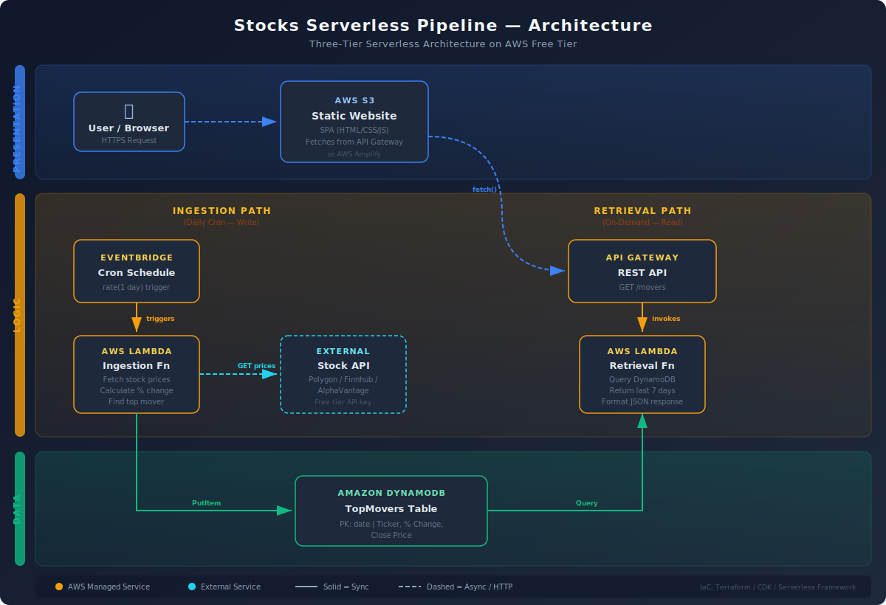

# Stocks Serverless Pipeline

A fully automated serverless system that tracks which tech stock from a curated watchlist had the highest percentage price change each day.

## Architecture Overview



This project implements a **three-tier serverless architecture**:

| Tier             | AWS Services                          | Purpose                                                                    |
| ---------------- | ------------------------------------- | -------------------------------------------------------------------------- |
| **Presentation** | S3 (Static Website Hosting)           | Single Page Application displaying the Top Mover history                   |
| **Logic**        | EventBridge, Lambda (x2), API Gateway | Ingestion (daily cron) and Retrieval (on-demand API) as separate functions |
| **Data**         | DynamoDB                              | Stores daily winner: date, ticker, % change, closing price                 |

### Key Design Decision: Separation of Concerns

The backend uses **two independent Lambda functions**:

- **Ingestion Lambda** — Triggered daily by EventBridge. Fetches stock data from Massive.com, calculates percentage change for each ticker, identifies the top mover, and writes the result to DynamoDB.
- **Retrieval Lambda** — Invoked by API Gateway on `GET /movers`. Reads the last 7 days of results from DynamoDB and returns clean JSON.

These functions share no code and have independent IAM roles with the "principle of least-privilege" permissions.

## Tech Stack

- **IaC:** Terraform
- **Runtime:** Python 3.9
- **Stock API:** Massive.com (Free Tier)
- **AWS Services:** Lambda, DynamoDB, API Gateway, EventBridge, S3

## Prerequisites

- [AWS CLI](https://docs.aws.amazon.com/cli/latest/userguide/getting-started-install.html) configured with your credentials
- [Terraform](https://developer.hashicorp.com/terraform/install) >= 1.0
- Python 3.9+
- A free [Massive.com](https://massive.com/) API key

## Project Structure

```
stocks-pipeline/
├── infra/                    # Terraform configuration
│   ├── main.tf               # Provider and core config
│   ├── variables.tf          # Input variables
│   ├── dynamodb.tf           # DynamoDB table definition
│   ├── lambda.tf             # Lambda functions + IAM roles
│   ├── eventbridge.tf        # Cron schedule rule
│   ├── api_gateway.tf        # REST API definition
│   ├── s3.tf                 # Static website hosting
│   └── outputs.tf            # Useful output values (URLs, ARNs)
├── lambdas/
│   ├── ingestion/            # Daily cron function
│   │   └── handler.py
│   └── retrieval/            # API-triggered function
│       └── handler.py
├── frontend/                 # Single Page Application
│   ├── index.html
│   ├── style.css
│   └── app.js
├── .gitignore
├── architecture-diagram.svg
└── README.md
```

### Infrastructure Organization

Terraform files are organized by **service co-location** rather than by resource type. Each `.tf` file is self-contained — it defines the AWS resource along with its IAM roles, permissions, and policies. For example, `lambda.tf` contains both Lambda functions and their least-privilege IAM roles, and `api_gateway.tf` includes the REST API definition alongside the Lambda invocation permission.

This approach means you can open any single file and understand everything about that service without jumping between files. For larger projects with shared roles or dedicated security teams, a separate `iam.tf` would be more appropriate.

## Deployment

### 1. Clone and Configure

```bash
git clone https://github.com/alexis-bustos/stocks-pipeline.git
cd stocks-pipeline
```

### 2. Set Your Variables

Create a `terraform.tfvars` file in the `infra/` directory (this file is gitignored):

```hcl
massive_api_key = "your-massive-api-key-here"
aws_region      = "us-east-1"
```

### 3. Deploy Infrastructure

```bash
cd infra
terraform init
terraform plan
terraform apply
```

### 4. Deploy Frontend

```bash
# After terraform apply, upload the frontend to the S3 bucket:
aws s3 sync ../frontend/ s3://$(terraform output -raw frontend_bucket_name)
```

### 5. Verify

- Visit the S3 website URL from `terraform output frontend_url`
- Check the API at `terraform output api_url`

## API Reference

### GET /movers

Returns the last 7 days of top stock movers.

**Response:**

```json
{
  "data": [
    {
      "date": "2026-03-03",
      "ticker": "TSLA",
      "percent_change": -4.72,
      "close_price": 248.5
    }
  ]
}
```

## Trade-offs & Challenges

### API Rate Limiting

Massive.com's free tier allows 5 API calls per minute. Since the watchlist contains 6 tickers, I implemented a `time.sleep(13)` delay between each call in the ingestion Lambda, keeping requests safely under the limit. This extends the Lambda's runtime to ~80 seconds, but it's well within Lambda's 15-minute maximum. The trade-off is execution time for reliability. I also added retry logic with exponential backoff — if a request fails, the function waits progressively longer before retrying, and if rate-limited (HTTP 429), it waits 60 seconds before the next attempt.

### Free Tier Data Availability

During development, I discovered that Massive.com's free plan restricts access to recent data only — historical dates (e.g., 2023) are not available through the Daily Open/Close endpoint. The solution was straightforward: the Lambda fetches the previous trading day's data, which is always within the free tier's window. I also added weekend-skipping logic so the function correctly walks back to Friday when triggered on a Monday.

### CLI Timeout During Testing

When manually invoking the ingestion Lambda for testing, the AWS CLI's default 60-second read timeout caused the command to fail — even though the Lambda was still running successfully in AWS. I resolved this by adding `--cli-read-timeout 150` to the invoke command. This was a good reminder that client-side timeouts and server-side execution are independent concerns.

### Debugging Authentication Errors

The initial Lambda deployment returned HTTP 403 errors on all tickers. The API key worked fine when tested locally via curl, and even worked from within the Lambda in an isolated debug test. The root cause turned out to be Massive.com's rate limiter returning 403 (instead of the expected 429) after a previous timed-out invocation had already consumed the rate limit. This reinforced the importance of CloudWatch logging — every API call in the ingestion function logs the request and response, which made it possible to trace the issue.

### Security Approach

API keys are stored in `terraform.tfvars` (gitignored) and injected into Lambda as environment variables marked as `sensitive` in Terraform. The CI/CD pipeline uses GitHub Secrets for the same purpose, ensuring credentials never appear in source control or workflow logs. For a production system, I would migrate the API key to AWS Secrets Manager for encryption at rest and automatic key rotation support.

### Separation of Concerns

The ingestion and retrieval Lambda functions are fully independent — separate code, separate IAM roles with least-privilege permissions (ingestion can only `PutItem`, retrieval can only `Query`), and separate triggers. This means a change to the stock-fetching logic has zero impact on the API layer, and vice versa.

### What I Would Add Next

- **CloudWatch Alarms**: Alert via SNS if the ingestion Lambda fails, so data gaps are caught immediately.
- **Data Validation**: Verify that the Massive API response contains valid open/close prices before calculating percentage change.
- **Caching**: Add a TTL-based cache on the API Gateway response to reduce Lambda invocations for repeated frontend requests.

## License

MIT
